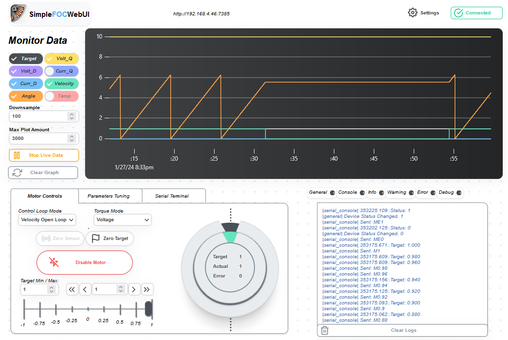

## *Simple**FOC**Web UI*

Built from [*Simple**FOC**Studio*](https://github.com/JorgeMaker/SimpleFOCStudio) By JorgeMaker.


#### Brief Intro

Adapted from *Simple**FOC**Studio*

Graphical user interface for the [*Simple**FOC**library*](https://github.com/simplefoc). This application allows to tune and configure any BLDC/Stepper *Simple**FOC**library* controlled device, using serial port communications.

#### The main features are:

Adapted from *Simple**FOC**Studio*

- Plug and play with the *Simple**FOC**library* version 2.1
- Real-time tuning and configuration of the motors
- Real-time plotting and monitoring of motor variables
- Code generation for easier integration of the tuned parameters in your code
- Built with web based frontend

<p align="center">
  
</p>

### Installation

### Conda

Instruction adapted from *Simple**FOC**Studio*
1. Install Python if you don't have it installed yet
    - [Install Anaconda](https://docs.anaconda.com/anaconda/install/)
    - Once you have your Anaconda running open your terminal (on windows anaconda prompt) and run:
    ```sh
    conda env create --name simplefoc -f environment.yml
    ```
    - Once this is done you will never have to run that command again, from now on you will just need:
    ```sh
    conda activate simplefoc
    ```
2. Clone this repository or download the zip file
3. Enter the folder containing the repository using the terminal
    -  the command will be something like this:
    ```sh
    cd  some_path_on_disk/SimpleFOCWebUI
    ```

### Pip
  ```sh
  python -m pip install -r requirements.txt
  ```

Once you have done all the steps above you do not need to repeat them any more. All you need to do the next time is open your terminal in the *Simple**FOC**WebUI* directory and run the command:
```sh
python simpleFOCWebUI.py
```
Or if using Anaconda:
```sh   
conda activate simplefoc
python simpleFOCWebUI.py
```

### Uploading pairing Arduino Code


Like *Simple**FOC**Studio*, you will need to run the corresponding serial interface.

Basically there are two things you need to do:
1. Use the commander interface and add the motor to the commander
2. Use the monitoring and add the `motor.monitor()` in the loop

Here is a mockup of the code:

```cpp
#include <SimpleFOC.h>

....

// include commander interface
Commander command = Commander(Serial);
void doMotor(char* cmd) { command.motor(&motor, cmd); }

void setup(){
  ....
  // add the motor to the commander interface
  // The letter (here 'M') you will provide to the SimpleFOCStudio
  command.add('M',doMotor,'motor');
  // tell the motor to use the monitoring
  motor.useMonitoring(Serial);
  motor.monitor_downsample = 0; // disable monitor at first - optional
  ...

}
void loop(){
  ....

  ....
  // real-time monitoring calls
  motor.monitor();
  // real-time commander calls
  command.run();
}
```


#### TODO 

1. Compatibility with *Simple**FOC**Studio*
2. Custom Commands. (Besides serial terminal)
3. Zero Sensor (Offset / Electrical) Doesn't work just yet.
4. Recover nicely on unexpected device / backend disconnect.
5. Fix random bugs. Sync any missing parameters which needs to be synced.
6. More device introspection / controls. (ie. Did FOC init work?)
7. Separated python scripting library
8. Version with web serial so no need for python backend??
9. Clean up code (Use Class, Not have random config formats everywhere.)
10. Make it more usable on multiple devices at once.
11. Make the UI responsive and support other viewport sizes such as phones.
